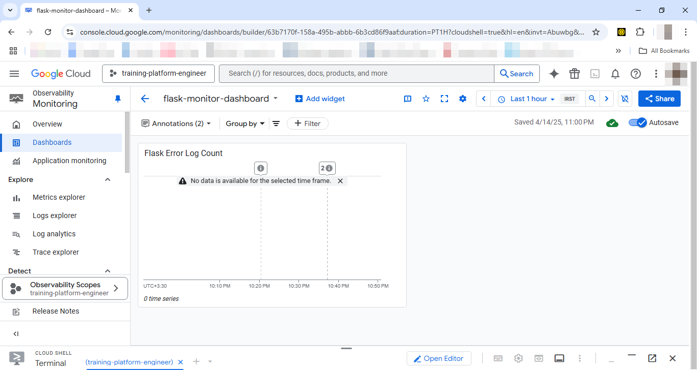

# GCP Kubernetes Monitoring Demo

A simple Flask app deployed on Google Kubernetes Engine (GKE) with centralized logging and monitoring using Google Cloud Operations (Cloud Logging & Monitoring).

## 🧱 Stack

- Python Flask
- Docker
- Google Cloud Platform (GCP)
  - GKE (Autopilot)
  - Cloud Logging
  - Cloud Monitoring
- Kubernetes

## 🚀 Deployment Steps

1. Clone this repo:
git clone https://github.com/AzinBehdarvand/monitoring-demo.git

2. Build and push Docker image:
docker build -t gcr.io/YOUR_PROJECT_ID/flask-monitor-demo:v1 . docker push gcr.io/YOUR_PROJECT_ID/flask-monitor-demo:v1

3. Deploy to GKE:
kubectl apply -f k8s-deployment.yaml

4. Get external IP:
kubectl get service flask-monitor-service

5. Test endpoints:
- `/` → Info log
- `/error` → Error log

## 📊 Monitoring & Logging

- All logs go to Cloud Logging
- Custom dashboard created in Cloud Monitoring (GCP)
- Includes error count, CPU usage, and pod uptime

## 📸 Screenshots

## ✨ Features

- Auto-scalable Kubernetes deployment on GKE (Autopilot)
- Real-time log collection via Cloud Logging
- Dashboard visualization via Cloud Monitoring
